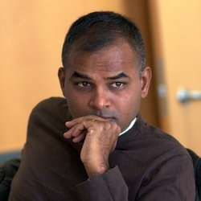
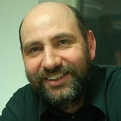
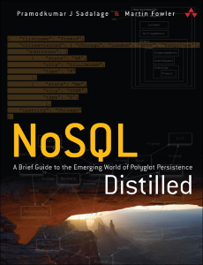

<!--
  bespokeEvent: bullets.disable
-->

# NoSQL

_Professor:_ Flávio Coutinho

---
# Aulas

- Aula 1: [Introdução a NoSQL](classes/intro/) (31/08/2015)
- Aula 2: Teoria (CAP, _Map/Reduce_ etc.) (14/09/2015)
- Aula 3: _Key-Value databases_ (21/09/2015)
  - 18:50 - 20:30
  - 20:50 - 22:30: Prática
- Aula 4: _Document Stores_ (28/09/2015)
  - 18:50 - 20:30
  - 20:50 - 22:30: Prática
- Aula 5: Seminário e Prova (05/10/2015)
  - 18:50 - 20:30: [Seminários][seminar]
  - 20:50 - 22:30: Prova

[seminar]: https://github.com/fegemo/cefet-nosql/tree/master/assignments/seminar/README.md

---
# Objetivos

1. Explorar a **origem dos bancos NoSQL** e suas características distintivas em
   relação aos bancos de dados relacionais
1. Compreender a **teoria subjacente** à tecnologia usada nos bancos NoSQL
1. **Praticar modelagem de dados** em bancos NoSQL
1. Prover conhecimento para **tomada de decisão na escolha do modelo de dados**

---
# Bibliografia

  
  
  

    
    

  

- **Título**	_NoSQL Distilled_
- **Autores**	Pramod Sadalage, Martin Fowler
- **Editora**	 Addison-Wesley Professional, 2012

---
# Atividades Avaliativas

- Atividades Práticas (40 pontos, 21 e 28/09/2015)
- [Seminário][seminar] (30 pontos, 05/10/2015)
- Prova (30 pontos, 05/10/2015)

[seminar]: https://github.com/fegemo/cefet-nosql/tree/master/assignments/seminar/README.md
