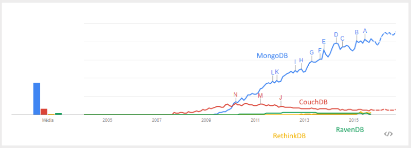
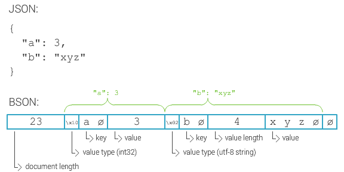
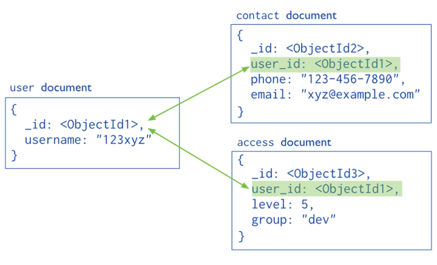
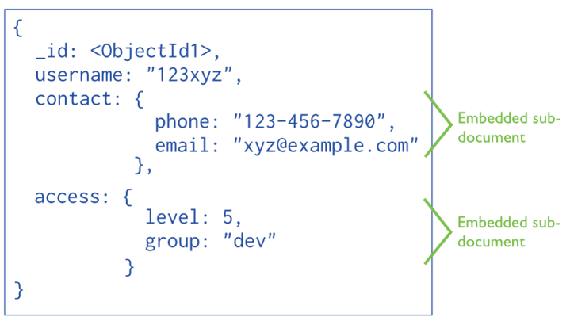
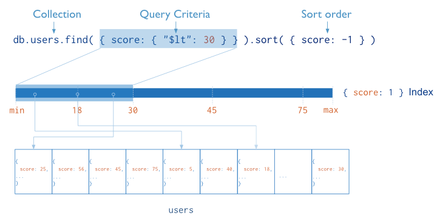
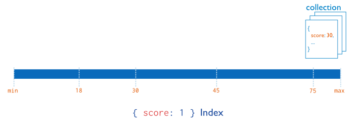
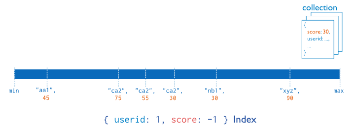

<!--
  bespokeEvent: bullets.disable
-->

# _Document Stores_

---
# Roteiro

1. Como funcionam os Bancos de Famílias de Colunas
1. Exemplos de Bancos de Famílias de Colunas
1. Apache Cassandra
1. Quando usar + quando não usar

---
## Introdução aos B. Famílias de Colunas

---

---
## Em quem vamos focar?



---
<!--
  backdrop: cassandra-troy
-->

# 


---
## 

- Dados possuem formato flexível (parcialmente _schemaless_)
  - As famílias de colunas possue _schema_, mas as colunas não
- A interface com o banco é feita usando
  <abbr title="Cassandra Query Language">CQL</abbr>
- Origem: Facebook se inspirou no BigTable (armazenamento) e no DynamoDB
  (distribuição) e criou o Cassandra

---
## Objetivos

1. Escalabilidade massivamente linear
  
1. Completamente distribuído, sem <abbr title="Single Point of Failure">SPOF</abbr>

---
## Modelo de Distribuição

- Modelo _peer-to-peer_
- Replicação configurável (tipicamente 3)


---
## Forma de armazenamento

---
## CQL (Cassandra Query Language)

- Uma forma familiar para interagir com o banco:
  - `CREATE, ALTER, DROP`
  - `SELECT, INSERT, UPDATE, DELETE`
- Substituiu o _Thrift API_ que havia antes
- Provê definições do _schema_ em um contexto flexível (NoSQL)
  ```
  CREATE TABLE Cantor (
    name VARCHAR,
    type VARCHAR,
    country VARCHAR,
    style VARCHAR,
    born INT,
    died INT,
    PRIMARY KEY (name)
  )
  ```


---
## JSON e BSON

- JSON é um [formato aberto](http://json.org/) para representação de dados,
  **fácil para pessoas e máquinas lerem**
  - 
    Criado por Douglas Crockford, Engenheiro da YAHOO
- Pode ser usado pelo mesmo objetivo que o `XML`: **interoperabilidade de
  dados**
- Possui alguns tipos de dados:
  1. Números (_double_ de 64 bits)
  1. _Strings_ (texto)
  1. Valores _Boolean_ (`true`/`false`)
  1. _Arrays_
  1. Objetos (estilo tabelas _hash_)

---
## Exemplo de um Objeto em JSON

- Arquivo `celebridade_da_computacao.json`
  ```json
  {
    "_id" : 1,
    "nome" : { "primeiro" : "John", "ultimo" : "Backus" },
    "contribs" : [ "Fortran", "ALGOL", "Backus-Naur Form" ],
    "premio" : [
      {
        "nome" : "W.W. McDowell Award",
        "ano" : 1967,
        "entregue_por" : "IEEE Computer Society"
      }
    ]
  }
  ```

---
## Formato **JSON para Armazenar**

- Não é a melhor ideia, visto que:
  - O formato `JSON` não tem um tipo:
    1. Para data/_timestamp_
    1. Para diferenciar números inteiros/reais, 32/64bits
    1. Para representar um campo binário (_e.g._, imagem)
  - Ele é textual, então ocupa mais espaço em disco do que se fosse binário

---
## Formato **BSON**

- Os criadores do MongoDB propuseram, então, o
  **[_Binary `JSON`_](http://bsonspec.org/)**, que o **`JSON` atendesse a
  demanda de armazenamento**

  
  - Além dos tipos mencionados, há também o tipo `ObjectId`

---
## Documentos: **_ObjectId_**

- O `ObjectId` é um tipo de dados `BSON` usado como chave dos documentos
  - Ele tem 12 bytes e é construído por:
    - 4 bytes representando um **_timestamp_ do "agora"**
    - 3 bytes identificando a **máquina**
    - 2 bytes identificando o **_process id_**
    - 3 bytes de **um contador**, iniciando de um número aleatório
  - A ideia é que o `ObjectId` de cada documento seja único na coleção
  - **Todo documento recebe um campo _\_id_**, com um valor de `ObjectId` único
    gerado pelo banco
    - Contudo também podemos passar um valor único nosso para _\_id_

---
## Documentos: Estrutura com Referências



---
## Documentos: Estrutura Embutida



---
## Documentos: Operações de Escrita

Writes are atomic at the document level
A Denormalized data model facilitates atomic write operations.
Normalizing the data over multiple collection would require multiple write operation that are not atomic.

---
## Documentos: Crescimento do Banco

Each time a document is updated the modification are done changing affected attributes
Each document has a maximum size of 16MB
If the document size exceeds MongoDB relocates the document on disk.
In MongoDB 3.0 this problem is minimized using the Power of 2 Sized Allocation

---
## Documentos: **Índices**

Indexes allows efficient queries on MongoDB.
They are used to limit the number of documents to inspect
Otherwise, it has to scan every document in a collection.
By default MongoDB create indexes only on the _\_id_ field
Indexes are created using B-tree and stores data of fields ordered by values.
In addition MongoDB returns sorted results by using the index.

---
## Documentos: Índices (2)



---
## Documentos: Índices (3)



---
## Documentos: Índices (4)



---
## Documentos: **Tipos de Índices**

Geospatial Index: 2d and 2sphere indexes
Text Indexes: performs tokenization, stopwords removal and stemming.
Hashed Indexes: used to provide an hash based sharding

---
<!--
  backdrop: chapter
-->

# Quando usar + quando não usar
---
## Vantagens

- Escalabilidade praticamente linear
- Sem ponto único de falha (SPOF)
- Documentos são unidades independentes
- Parcialmente _schema free_:
  - Dados não estruturados podem ser facilmente armazenados

---
<div class="layout-split-2" style="height: auto;">
  <section style="border-right: 4px dotted silver;">
  <h2>Quando usar</h2>
    <ul style="text-align: left">
      <li>**Log de eventos**: diferentes tipos de eventos, várias aplicações</li>
      <li>**Gerenciadores de Conteúdo**: _schema free_ dá flexibilidade</li>
      <li>**_Web Analytics_**: atualizar contadores e outras métricas</li>
      <li>**_E-commerce_**: _schema_ flexível para diferentes categorias
        de produtos</li>
    </ul>
  </section>
  <section>
    <h2>Quando não usar</h2>
    <ul style="text-align: left">
      <li>**Transações com muitas operações**: atomicidade de operações entre
        documentos não é garantido. Novos bancos têm suporte: RabenDB</li>
      <li>**Consultas sobre estruturas agregadas que mudam muito**: se a
        estrutura dos agregados está sob constante alteração, eles devem
        ser normalizados</li>
    </ul>
  </section>
</div>

---
# Referências

- Livro _"NoSQL Distilled"_
  - Capítulo 10: _Column-Family Stores_
