<!--
  bespokeEvent: bullets.disable
-->

# _Document Stores_

---
# Roteiro

1. Como funcionam os bancos de documentos
1. Exemplos de bancos de documentos
1. O MongoDB
1. Quando usar + quando não usar

---
## Introdução aos Bancos de Documentos

- **Documentos** são o principal conceito
- Um banco de dados orientado a documentos armazena e recupera documentos
  - Eles podem ser **salvos em formatos "interoperáveis"**:
    - <abbr title="eXtensible Markup Language">XML</abbr>, <abbr title="JavaScript Object Notation">JSON</abbr>, <abbr title="Binary JSON">BSON</abbr> etc.
- Documentos são:
  - Auto-descritivos
  - Estruturas de dados hierárquicas (mapas, coleções e escalares)
    ```json
    {
      "name": "Sue",
      "age": 26,
      "groups": ["news", "sports"]
    }
    ```
---
## O que é um Banco de Documentos

- Eles armazenam documentos como a parte **valor** dos bancos _key-value_,
  sendo que os documentos:
  - São indexados usando uma [árvore B][btree]
  - São consultados usando API para linguagens (não há SQL)
- Considere um banco de documentos como um _key-value_ onde o _value_ é
  examinável pelo banco (`WHERE`)

| Oracle                      | MongoDB              |
|-----------------------------|----------------------|
| instância de banco de dados | instância do MongoDB |
| schema                      | database             |
| table                       | collection           |
| row                         | document             |
| rowid                       | _id                  |

[btree]: https://pt.wikipedia.org/wiki/%C3%81rvore_B

---
## Exemplo: **Coleção** de viajantes

```json
[
  {
    "firstname": "Martin",
    "likes": ["Biking", "Photography"],
    "lastcity": "Boston"
  },
  {
    "firstname": "Pramod",
    "lastcity": "Chicago"
  }
]
```

- Documentos de uma coleção podem ter atributos diferentes
- Isto difere de uma tabela relacional onde colunas:
  - Armazenam o mesmo tipo de valor ou `null`

---
<!--
  backdrop: chapter
-->

# Exemplos de bancos de documentos
---
# Alguns Bancos de Documentos

- [**MongoDB**](https://www.mongodb.org/)
  - JSON, API com drivers, _auto-sharding_, MapReduce
- [CouchDB](http://couchdb.apache.org/)
  - JSON, JavaScript para MapReduce e acesso via HTTP
- [RethinkDB](https://www.rethinkdb.com/)
  - JSON, _real-time_, API com drivers
- [RavenDB](http://ravendb.net/)
  - JSON, Transações ACID, acesso via HTTP ou .NET

---
## <abbr title="Cluster of unreliable commodity hardware">Couch</abbr>DB

- 
  Escrito em Erlang, 2005-2008, doado à fundação Apache
- Documentos armazenados em `JSON`
- A linguagem de consulta é em JavaScript/RESTful WebService e
  suporta MapReduce
- Conceito de <abbr title="Multi-Version Concurrency Control">MVCC</abbr> como
  uma estratégia de **resolução otimista para conflitos**

---
## CouchDB: Características

- Característica de destaque: **replicação _multi-master_**
  - Todo nó pode **escrever**
  - Diferente de _peer-to-peer_ porque é síncrono
  - É possível por causa do estilo _append-only_ dos _commits_
- Versões para dispositivos móveis
- Interação com os dados via HTTP (RESTful WebService) apenas
  - Não há um protocolo binário

---
## 

- Escrito em C++, executa em Linux e OSX
- Armazena documentos no formato JSON
- Principal característica: **notificação de atualizações para aplicação
  _real-time_**
- Suporta MapReduce e consultas geoespaciais

```js
r.table('tv_shows')
  .insert([
    { name: 'Star Trek TNG', episodes: 178 },
    { name: 'Battlestar Galactica', episodes: 75 }
  ]);
```

---
## Em quem vamos focar?


---
<!--
  backdrop: mongodb-forest
-->

# 

---
## 

<p class="note" style="width: 90%;">
  _“MongoDB” derives from the word **“humongous”** because of its ability to
  scale up with ease and hold very large amounts of data._
</p>

- Dados possuem formato flexível
- Nossa interface com o banco é feita por documentos no formato
  <abbr title="JavaScript Object Notation">`JSON`</abbr>, mas
  são armazenados em <abbr title="Binary JSON">`BSON`</abbr>
  - `BSON` ocupa bem menos espaço
  - `BSON` possui bem mais tipos de dados do que `JSON`
- Relações podem ser representadas como referências ou como documentos
  aninhados (embutidos)
- _Whitepaper_ da [Arquitetura do MongoDB](http://s3.amazonaws.com/info-mongodb-com/MongoDB_Architecture_Guide.pdf)

---
## Por onde começar (1)


- [Site do MongoDB - _open-source_](https://www.mongodb.org/)
- [Site da empresa do MongoDB ](https://www.mongodb.com/)

---
## Por onde começar (2)


- [Universidade MongoDB](https://university.mongodb.com)
  1. MongoDB para desenvolvedores (Java, .NET...)
  1. MongoDB para DBAs, etc.

---
## JSON e BSON

- JSON é um [formato aberto](http://json.org/) para representação de dados,
  **fácil para pessoas e máquinas lerem**
  - 
    Criado por Douglas Crockford, Engenheiro da YAHOO
- Pode ser usado pelo mesmo objetivo que o `XML`: **interoperabilidade de
  dados**
- Possui alguns tipos de dados:
  1. Números (_double_ de 64 bits)
  1. _Strings_ (texto)
  1. Valores _Boolean_ (`true`/`false`)
  1. _Arrays_
  1. Objetos (estilo tabelas _hash_)

---
## Exemplo de um Objeto em JSON

- Arquivo `celebridade_da_computacao.json`
  ```json
  {
    "_id" : 1,
    "nome" : { "primeiro" : "John", "ultimo" : "Backus" },
    "contribs" : [ "Fortran", "ALGOL", "Backus-Naur Form" ],
    "premio" : [
      {
        "nome" : "W.W. McDowell Award",
        "ano" : 1967,
        "entregue_por" : "IEEE Computer Society"
      }
    ]
  }
  ```

---
## Formato **JSON para Armazenar**

- Não é a melhor ideia, visto que:
  - O formato `JSON` não tem um tipo:
    1. Para data/_timestamp_
    1. Para diferenciar números inteiros/reais, 32/64bits
    1. Para representar um campo binário (_e.g._, imagem)
  - Ele é textual, então ocupa mais espaço em disco do que se fosse binário

---
## Formato **BSON**

- Os criadores do MongoDB propuseram, então, o
  **[_Binary `JSON`_](http://bsonspec.org/)**, que o **`JSON` atendesse a
  demanda de armazenamento**

  
  - Além dos tipos mencionados, há também o tipo `ObjectId`

---
## Documentos: **_ObjectId_**

- O `ObjectId` é um tipo de dados `BSON` usado como chave dos documentos
  - Ele tem 12 _bytes_ e é construído por:
    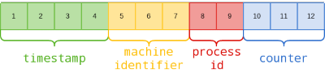
  - A ideia é que o `ObjectId` de cada documento seja único na coleção
  - **Todo documento recebe um campo `_id`**, com um valor de `ObjectId` único
    gerado pelo banco
    - Contudo também podemos passar um valor único nosso para `_id`

---
## Ferramentas

|                   | MongoDB          | MySQL  | Oracle  | Informix  | DB2        |
|-------------------|------------------|--------|---------|-----------|------------|
| Servidor do Banco | [mongod][mongod] | mysqld | oracle  | IDS       | DB2 Server |
| Cliente           | [mongo][mongo]   | mysql  | sqlplus | DB-Access | DB2 Client |

- Além de `mongod` e `mongo`, há diversas ferramentas auxiliares. Algumas são:
  - `mongoimport`, `mongoexport`
  - [Robomongo](http://robomongo.org/) (_3rd-party_)
  - [E outras várias ferramentas administrativas](http://docs.mongodb.org/ecosystem/tools/administration-interfaces/) não oficiais

[mongo]:http://docs.mongodb.org/manual/reference/program/mongo/#bin.mongo
[mongod]: http://docs.mongodb.org/manual/reference/program/mongod/#bin.mongod


---
<!--
  backdrop: emphatic
-->

# DQL, DML e DDL

---
## **Consultas**

- Todas as consultas são feitas usando o método `db.collection.find()`
  - Recebe os **critérios**, **projeção** e retorna um **cursor**
- Todas as consultas **operam em uma <u>única coleção</u>**
- Consulta em MongoDB:
  
- Em um banco relacional:
  

---
## <abbr title="Data Query Language">D**Q**L</abbr>: **Consultas**

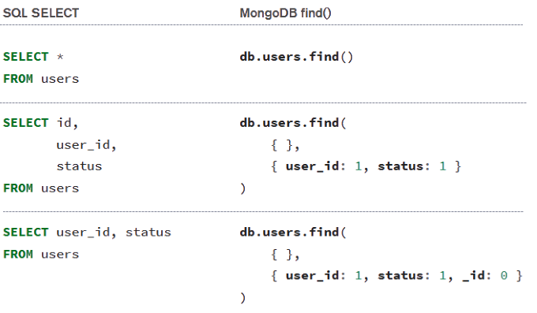

---
## <abbr title="Data Query Language">DQL</abbr>: Consultas - **WHERE**

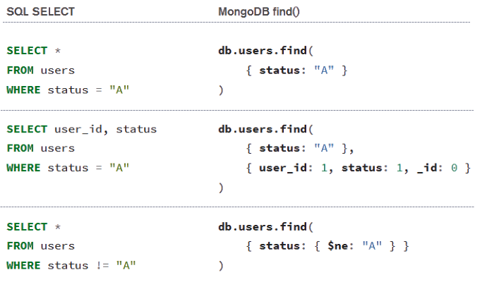

---
## <abbr title="Data Query Language">DQL</abbr>: Consultas - WHERE (2)

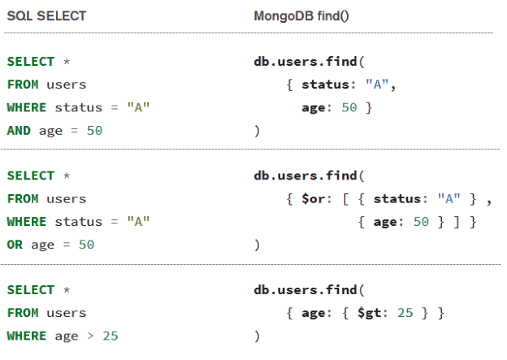

---
## <abbr title="Data Query Language">DQL</abbr>: Consultas - **Regex**

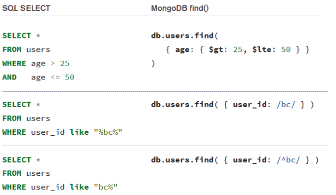

---
## <abbr title="Data Query Language">DQL</abbr>: Consultas - **Ordenando**

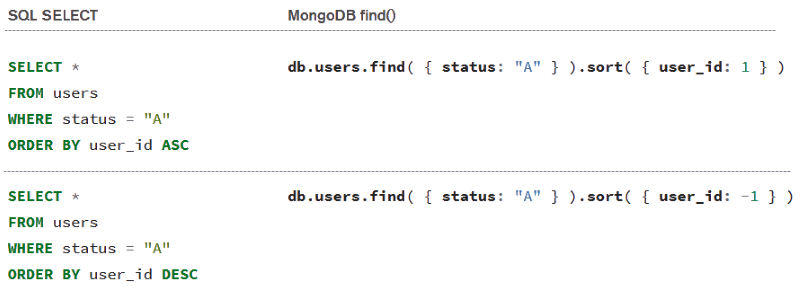

---
## <abbr title="Data Query Language">DQL</abbr>: Consultas - **Contando**

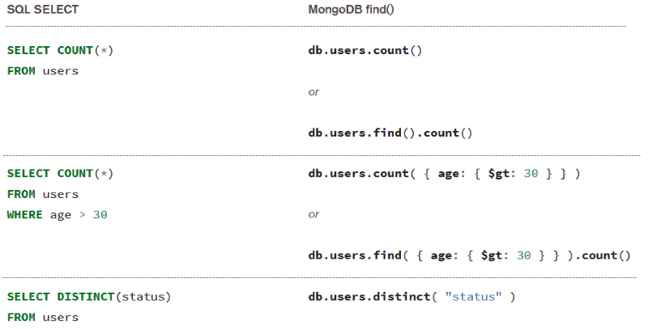

---
## <abbr title="Data Query Language">DQL</abbr>: Consultas - **_Limit_ e _Skip_**

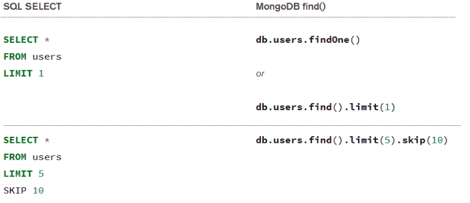

---
## <abbr title="Data Definition Language">D**D**L</abbr>: **Criar**

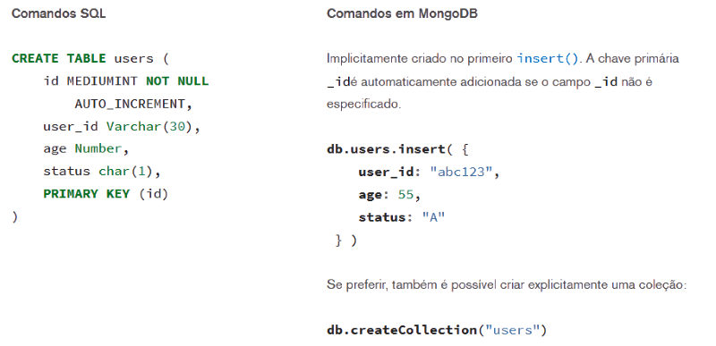

---
## <abbr title="Data Definition Language">DDL</abbr>: Alterar (**novo campo**)

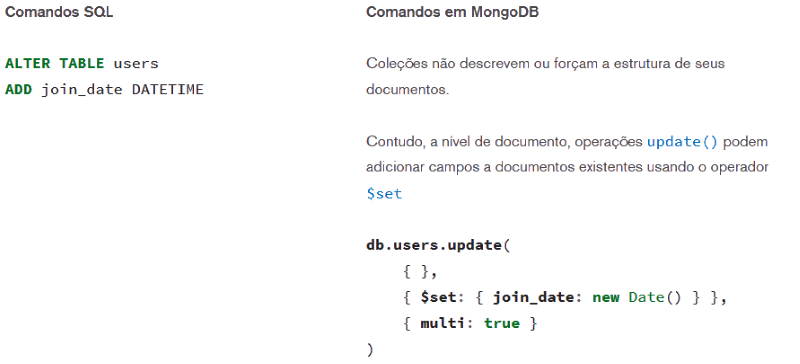

---
## <abbr title="Data Definition Language">DDL</abbr>: Alterar (**remover campo**)


---
## <abbr title="Data Manipulation Language">D**M**L</abbr>: **Inserção**


---
## <abbr title="Data Manipulation Language">DML</abbr>: **Atualização**

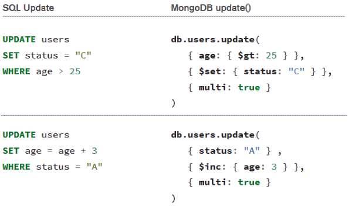

---
## <abbr title="Data Manipulation Language">DML</abbr>: **Exclusão**

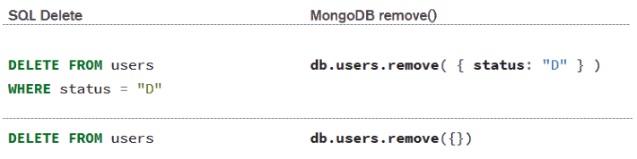

---
<!--
  backdrop: emphatic
-->

# Modelando os Dados

---
## Modelagem

- Dados no MongoDB possuem _schema_ flexível (_schemaless_)
  - Coleções não forçam a estrutura de seus documentos
  - Isso reduz o descompasso de impedância
- O desafio é modelar os dados de forma a atender:
  1. **A demanda da aplicação** (que tipos de uso dos dados serão feitos)
  1. As características de desempenho do MongoDB
  1. Os padrões de recuperação dos dados (relatórios)
- A principal decisão é sobre a **estrutura dos documentos**:
  1. **Referências** entre documentos
  1. Documentos **embutidos**

---
## Documentos: Estrutura com **Referências**

- Estrutura normalizada
- Referências armazenam relacionamentos entre documentos
- **Aplicações** podem usá-las para acessar dados relacionados

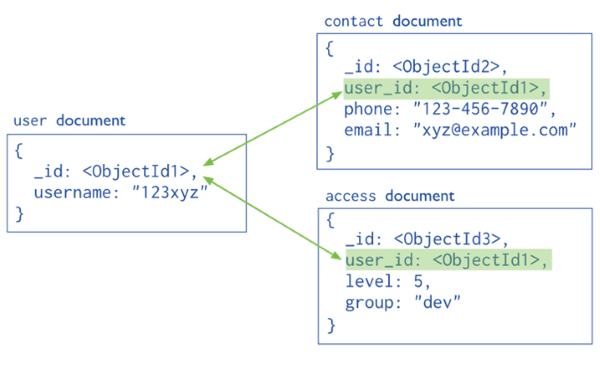

---
## Documentos: Estrutura **Embutida**

- Estrutura desnormalizada
- Capturam os relacionamentos ao armazenar objetos aninhados
- Torna o _sharding_ possível/eficiente

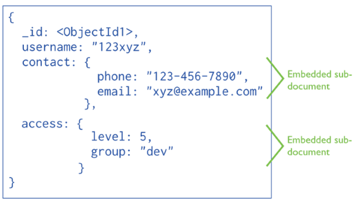

---
## Documentos: Operações de Escrita

- Escritas são **atômicas no nível de um documento**
- Um modelo de dados desnormalizado facilita as escritas atômicas
- Normalizar os dados em várias coleções pode requerer múltiplas operações
  de escrita que não são atômicas
  - Aumento no risco de inconsistência

---
## Critérios para escolher a estrutura

<div class="layout-split-2" style="height: auto;">
  <section style="border-right: 4px dotted silver;">
    <h3><u>Embutidos</u></h3>
    <ul style="text-align: left;">
      <li>Usar quando:
        <ul>
          <li>Há relações de "contém" entre entidades (_one-to-one_)</li>
          <li>Há relações de um-pra-muitos entre entidades</li>
        </ul>
      </li>
      <li>**Desempenho para leitura** (muito) melhor </li>
      <li>É possível **alterar** dados de forma **atômica**</li>
      <li>Requer **mais espaço**</li>
    </ul>
  </section>
  <section>
    <h3><u>Referências</u></h3>
    <ul style="text-align: left;">
      <li>Usar quando:
        <ul>
          <li>Embutir resultaria em duplicação mas pouco ganho de desempenho</li>
          <li>Representar relacionamentos mais complexos (_many-to-many_)</li>
          <li>Modelar grandes _datasets_ hierárquicos</li>
        </ul>
      </li>
      <li>Mais flexibilidade</li>
      <li>Menos espaço para armazenar</li>
      <li>Desempenho menor</li>
    </ul>
  </section>
</div>

---
## Modelando para **Atomicidade** (1/2)

- Caso: manter informação sobre livros, inclusive **cópias disponíveis** e
  **cópias em processo de venda**:
  ```js
  {
      _id: 123456789,
      title: "MongoDB: The Definitive Guide",
      author: [ "Kristina Chodorow", "Mike Dirolf" ],
      published_date: ISODate("2010-09-24"),
      pages: 216,
      language: "English",
      publisher_id: "oreilly",
      available: 3,
      checkout: [ { by: "joe", date: ISODate("2012-10-15") } ]
  }
  ```

---
## Modelando para **Atomicidade** (2/2)

- Quando uma cópia do livro é colocada no carrinho, devemos atualizar o
  documento de forma atômica:
  ```js
  db.books.update (
     { _id: 123456789, available: { $gt: 0 } },
     {
       $inc: { available: -1 },
       $push: { checkout: { by: "abc", date: new Date() } }
     }
  )
  ```

---
## Voltando às **consultas** (1/2)...

- Considere uma coleção `inventory` com documentos semelhantes a:
  ```js
  {
    item: "Screwdriver",
    producer: {
       company: "Philips",
       address: "Amsterdan"
    },
    stock: [ { size: "S", qty: 25 }, { size: "M", qty: 50 } ],
    category: "tools"
  }
  ```
- Para consultar **campos de documentos embutidos**, usamos a
  **_dot notation_**

---
## Voltando às **consultas** (2/2)...

- Um _match_ exato de um "subdocumento":
  ```js
  db.inventory.find({ producer: {company: 'ABC', address: 'a' }})
  ```
- Campos individuais de um subdocumento:
  ```js
  db.inventory.find({ 'person.company': 'ABC' });
  ```
- Elemento específico de um _array_:
  ```js
  db.inventory.find({ 'favorite_fruits.0': 'Apple' });
  ```
- [Referência](http://docs.mongodb.org/manual/tutorial/query-documents/)
  completa na documentação do MongoDB

---
## **Índices**

- Índices possibilitam o **uso eficiente de consultas** no MongoDB
- São usados para **limitar o número de documentos a serem procurados**
  - _collection scan_ _vs_ _index lookup_
- Por padrão, o MongoDB cria um índice para o campo _\_id_
- Índices são criados usando árvores B e armazenam os dados dos campos
  ordenados pelos valores

---
## Índices (2)

- Cada nó da árvore possui um valor do campo do índice
- As folhas são apontadores para os documentos da coleção

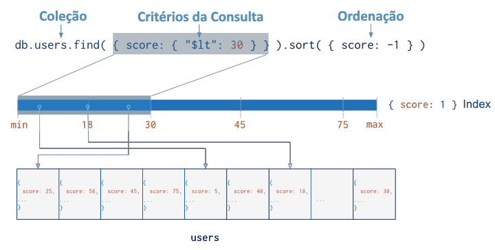

---
## **Tipos de Índices**

- **Índice padrão**: no campo `_id`
- **Índice de um único campo**: apenas um campo ;)
- **Índice composto**: múltiplos campos fazem parte do índice
- **Índice multi-chave**: quando o índice é criado em um campo que é um _array_
- **Índice geoespacial**:
  - `2d` para estruturas planares e
  - `2sphere` para geometria esférica
- **Índice textual**: faz _tokenization_, remoção de _stopwords_ e _stemming_
- **Índice _hash_**:
  - Usado para se fazer _sharding_
  - Suporta apenas comparador de igualdade  

---
## Criando Índices

- Coleção `friends`:
  ```js
  {
    _id: ObjectId(...),
    name: "Alice",
    age: 27,
    profession: "Programmer"
  }
  ```
- Criando um índice de campo único para `profession`
  ```js
  db.friends.createIndex({ profession: 1 });
  ```

---
## Plano de Execução ([referência](http://docs.mongodb.org/manual/reference/explain-results/))

- Para **ver um índice em ação**, podemos pedir ao MongoDB para **mostrar
  o plano de execução** usando **`cursor.explain()`**:
  ```js
  db.inventory.find({ type: 'food'}).explain();
  ```
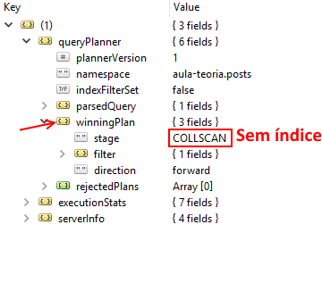
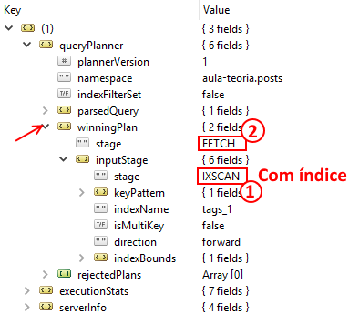

---
<!--
  backdrop: emphatic
-->

# Replicação e _Sharding_

---
## Replicação (1/2)

- 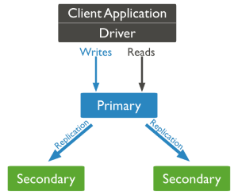
  Replicação no MongoDB é feita no modelo _master-slave_
  - O termo adotado é **primário-secundário**
- Um conjunto de réplicas é um grupo de instâncias de `mongod` que
  armazenam o mesmo _dataset_
- O `mongod` **primário recebe todas** solicitações de **escrita**
- Os `mongod` **secundários sincronizam com o primário** e <u>podem¹</u> recebem
  solicitações de **leitura**
  - ¹ não é o comportamento padrão
  - Se o primário falha, os secundários auto-elegem um novo primário

---
## Replicação (2/2)

- No MongoDB, replicação é muito mais uma forma de manter resiliência do que
  de melhorar a performance de leitura e escrita (_availability_)
  - Lendo/escrevendo no master, atinge-se **consistência forte** sempre
  - Ao usar os secundários, temos **consistência fraca** ou **eventual**
    - (+) Aumenta a disponibilidade
    - (+) Pode reduzir a latência (_e.g._, localidade geográfica)
    - (+) Tolerância a falhas na rede (para leitura)

---
## _Sharding_ (1)

- 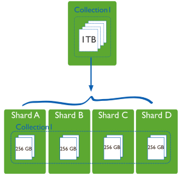
  No MongoDB, escala-se horizontalmente **dividindo-se os dados em _shards_**
  - Cada _shard_ é um banco independente e, **coletivamente, eles formam um
    único banco de dados lógico**
- Benefícios:
  - (+) reduz o número de operações cada _shard_
  - (+) reduz a quantidade de dados em cada _shard_

---
## _Sharding_ (2)

- 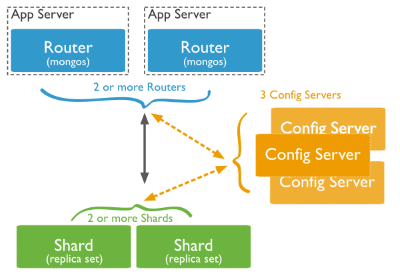
  **_shard_**: armazena uma parcela dos dados
  - Para ter alta disponibilidade e consistência, cada _shard_ deve ser uma
    _replica set_
- **_query router_**: uma instância de `mongos`
  - Direciona as operações para os _shards_ apropriados
  - Pode existir mais de 1 _router_ para dividir a carga
- **_config server_**: armazena a configuração do _cluster_
  - Contém um mapeamento dos dados para _shards_
  - O _router_ usa esses dados

---
## _Sharding_: **Particionando os dados**

- Dados são **particionados no nível da coleção**
- Para fazer _sharding_ em uma coleção, uma **<u>_shard key_</u>** deve ser
  escolhida, que pode ser:
  - Um campo indexado
  - Campos que formam um índice composto
- O MongoDB **divide os valores da _shard key_ em grandes _chunks_** e os
  distribui de forma equilibrada entre os _shards_
- Para saber em qual _chunk_ vai cada _shard key_, o MongoDB usa:
  1. _Sharding_ baseado em **intervalo**
  1. _Sharding_ baseado em **_hash_**

---
## Como distribuir _shard keys_ em _chunks_

- _Sharding_ baseado em **intervalo**:
  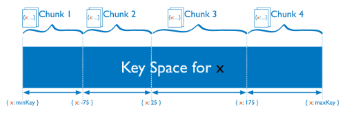

- _Sharding_ baseado em **_hash_**:
  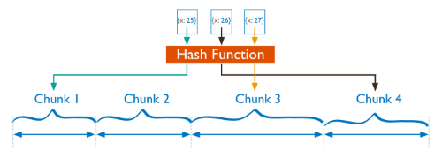

---
<!--
  backdrop: chapter
-->

# Quando usar + quando não usar
---
## Vantagens

- Documentos são unidades independentes
- Lógica de aplicação é fácil de escrever
- _Schema free_:
  - Dados não estruturados podem ser facilmente armazenados
  - Migrações de dados podem ser evitadas já que o banco não precisa
    ter conhecimento de um _schema_

---
<div class="layout-split-2" style="height: auto;">
  <section style="border-right: 4px dotted silver;">
  <h2>Quando usar</h2>
    <ul style="text-align: left">
      <li>**Log de eventos**: diferentes tipos de eventos, várias aplicações</li>
      <li>**Gerenciadores de Conteúdo**: _schema free_ dá flexibilidade</li>
      <li>**_Web Analytics_**: atualizar contadores e outras métricas</li>
      <li>**_E-commerce_**: _schema_ flexível para diferentes categorias
        de produtos</li>
    </ul>
  </section>
  <section>
    <h2>Quando não usar</h2>
    <ul style="text-align: left">
      <li>**Transações com muitas operações**: atomicidade de operações entre
        documentos não é garantido. Novos bancos têm suporte: RabenDB</li>
      <li>**Consultas sobre estruturas agregadas que mudam muito**: se a
        estrutura dos agregados está sob constante alteração, eles devem
        ser normalizados</li>
    </ul>
  </section>
</div>

---
# Referências

- Livro _"NoSQL Distilled"_
  - Capítulo 8: _Document Stores_
- [Manual do MongoDB](http://docs.mongodb.org/manual/core/) (3.0)
