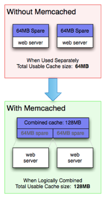
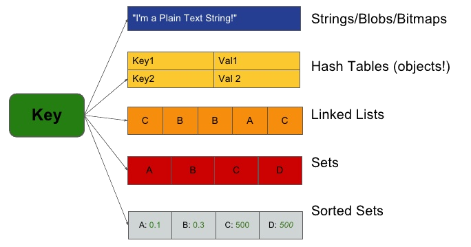
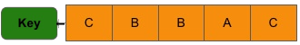
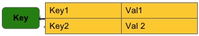

<!--
  bespokeEvent: bullets.disable
-->

# _Key-Value Stores_

---
# Roteiro

1. Como funciona um _key-value store_
1. Exemplos de bancos
1. Fazendo um Twitter usando **Redis** (<abbr title="Proof of Concept">POC</abbr>)
1. Quando usar + quando não usar

---
<!--
  backdrop: chapter
-->

# Como funciona um _key-value store_

---
## **Características** dos bancos _key-value_

- Um banco _key-value_ é simplesmente uma tabela _hash_
  - Em que todos os acessos a dados são feitos via **"chaves primárias"**
- Um cliente tem 3 operações com o banco:
  1. **Recuperar** (_GET_) um valor (_string_) associado a uma chave
  1. **Salvar/Atualizar** (_POST/PUT_) um valor associado a uma chave
  1. **Excluir** (_DELETE_) um par chave-valor do banco

---
## Características dos bancos _key-value_ (2)

- Acesso aos dados via _key-value_ possibilitam alta performance e
  disponibilidade dos dados
- Tanto chaves como valores podem ser objetos complexos e mesmo listas,
  _maps_ e outras estruturas de dados
- **Só se garante consistência** para operações realizadas **em uma mesma
  chave** (ainda assim é **_eventually consistent_**)

---
<div class="layout-split-2" style="height: auto;">
  <section style="border-right: 4px dotted silver;">
    <h2>Cons</h2>
    <ul style="text-align: left">
      <li>Sem filtros complexos (`WHERE`)</li>
      <li>`JOIN`s devem ser feitos em código (no cliente)</li>
      <li>Sem restrições de chave estrangeira</li>
      <li>Sem _triggers_</li>
    </ul>
  </section>
  <section>
    <h2>Pros</h2>
    <ul style="text-align: left">
      <li>Consultas eficientes (desempenho muito previsível)</li>
      <li>Facilmente distribuível em _cluster_</li>
      <li>Não há descompasso de impedância</li>
      <li>Usar um relacional + _cache_ nos força a usar o formato _key-value_</li>
    </ul>
  </section>
</div>

---
<!--
  backdrop: chapter
-->

# Exemplos de bancos

---
## Os mais populares

- [**Memcached DB**](http://memcached.org/)
- [**Riak KV**](http://basho.com/products/riak-kv/)
- [Berkeley DB](http://www.oracle.com/technetwork/database/database-technologies/berkeleydb/overview/index.html) – Oracle
- [**Redis**](http://redis.io) – Data Structure server
- [Aerospike](http://www.aerospike.com/) – Experimento da Intel para <abbr title="Solid State Drive">SSD</abbr>s
- [LevelDB](http://leveldb.org/) – _key-value_ da Google
- [DynamoDB](https://aws.amazon.com/pt/dynamodb/) – _key-value_ da Amazon (primeirão)
- [VoltDB](https://voltdb.com/) – Réplica do DynamoDB, código aberto

---
## 

- 
  Muito usado como um _cache_ em RAM de objetos de um banco de dados
  persistente
  - Operações Atômicas: _set/get/delete_
    - O(1)
  - _Hashing_ consistente das chaves
    - Quando aumentamos o tamanho da tabela _hash_, poucas entradas precisam
      ser movidas (K/n)
  - _Cache_ em memória - não há persistência
  - Auto distribuído, _auto-sharded_

---
## Uso típico do **Memcached**

- Cenário sem _cache_:
  ```js
  function get_user(int userid) {
    data = db_select("SELECT * FROM users WHERE userid = ?", userid);
    return data;
  }
  ```

---
## Uso típico do **Memcached** (2)

- Mesmo cenário, mas usando o Memcached:
  ```js
  function get_user(int uid) {
     data = memcached_fetch("userrow:" + uid);
     if (!data) {
        data = db_select("SELECT * FROM users WHERE userid = ?", uid);
        memcached_add("userrow:" + uid, data);
     }
     return data;
  }
  ```

---
## Riak KV

- 
  Banco de dados distribuído
- Escrito em Erlang, C e um pouco de JavaScript
- Tipos de dados: _basic, Sets and Maps_
- Terminologia Oracle _vs_ Riak:

| Oracle                      | Riak           |
|-----------------------------|----------------|
| instância de banco de dados | _cluster_ Riak |
| tabela                      | bucket         |
| registro                    | key-value      |
| rowid                       | key            |

---
## Riak KV (2)

- Riak nos permite **armazenar chaves em _buckets_** (baldes), que são apenas
  uma forma para segmentar as chaves
- O Riak **tem uma interface web (HTTP)** que nos permite interagir com ele
  como um _RESTful WebService_:
  - Operações:
    ```
    GET /buckets/BUCKET/keys/KEY
    PUT|POST /buckets/BUCKET/keys/KEY
    DELETE /buckets/BUCKET/keys/KEY
    ```
    - Exemplo:
      ```
      curl -i http://localhost:8098/buckets/session/keys/a7e618d9
      ```
- Um _whitepaper_ oficial do Riak: [Bancos relacionais _vs_ Riak](http://info.basho.com/rs/721-DGT-611/images/Relational%20to%20RiakKV.PDF)

---
<!--
  backdrop: chapter
-->

# Um Twitter usando Redis


[@joaomontanaro](https://twitter.com/_joaomontanaro)

---
## Motivação

- Muitos consideram que _key-value_ nunca poderiam ser usados em substituição
  a um banco relacional
  - Muitas vezes não devem mesmo :)
- Mas aqui vamos mostrar que um _key-value_ pode formar uma camada eficaz e
  eficiente para vários tipos de aplicação
- Selecionamos uma aplicação estilo Twitter para elucidar
  - Conheça o **Retwis**: http://retwis.redis.io/

---
## Funcionalidades Principais

- Vamos fazer:
  - Usuários postam atualizações (_tweets_)
  - Usuários seguem/deixam de seguir outros
  - Usuários podem ver uma _timeline_ de atualizações
- Fica para a próxima:
  - Usuários podem mencionar outros em suas atualizações
  - Usuários podem enviar mensagens privadas a outros
  - Usuários podem passar-pra-frente ("retweet") as mensagens
  - Uma API pública para aplicações externas

---


- Banco de _key-value_ em que o _value_ não precisa ser apenas um _blob_
  - Pode ser uma de 5_ish_  estruturas de dados
- Banco em memória, com possibilidade de persistência
- Extremamente rápido e versátil
- Código aberto, grande comunidade

---
## Tipos Estruturas de Dados no Redis



---
## <abbr title="Command Line Interface">CLI</abbr> do Redis


- **Salvar** um par _key-value_
  ```
  SET foo bar
  ```
- **Ler** um valor (_value_) usando sua chave (_key_)
  ```
  GET foo => bar
  ```
- **Excluir** um par _key-value_
  ```
  DEL foo
  ```

---
## <abbr title="Command Line Interface">CLI</abbr> do Redis (2)

- **Incrementa em 1** o valor contido em uma chave
  ```
  SET foo 10
  INCR foo => 11
  INCR foo => 12
  INCR foo => 13
  ```
  - `INCR` é uma operação atômica
    ```
    x = GET foo
    x = x + 1
    SET foo x
    ```
    - Estas 3 operações não são

---
## Estrutura de dados: **Lista**



- Além de apenas um _key-value_: **listas**
  ```
  LPUSH mylist a (lista possui 'a')
  LPUSH mylist b (lista possui 'b','a')
  LPUSH mylist c (lista possui 'c','b','a')
  ```
  - `LPUSH` significa _Left Push_ (adicionar ao início)
  - Também existe `RPUSH`
    - Será útil para o clone do Twitter: _e.g._, atualizações serão
      adicionadas para uma lista armazenada em uma chave com nome
      `usuario:atualizacoes`

---
## Estrutura de dados: **Lista** (2)

- `LRANGE` retorna um intervalo dos elementos da lista
  ```
  LRANGE mylist 0 1 => c,b
  LRANGE mylist 0 -1 => c,b,a
  ```
  - Assinatura: `LRANGE chave idx-inicial idx-final`
  - O argumento `idx-final` pode ser negativo, sendo que -1 representa
    o último elemento da lista, -2 o penúltimo etc.

---
## Estrutura de dados: **Conjunto**


- `SADD` adiciona um item a um conjunto (_set_)
- `SREM` remove um item
- `SINTER` faz uma interseção
- `SCARD` retorna a cardinalidade do conjunto
- `SMEMBERS` retorna todos os membros do conjunto

---
## Estrutura de dados: **Conjunto** (2)

- Exemplo de uso de um conjunto:
  ```
  SADD myset a
  SADD myset b
  SADD myset foo
  SADD myset bar
  SCARD myset => 4
  SMEMBERS myset => bar,a,foo,b
  ```

---
## Estrutura de dados: **Conjunto Ordenado**


- Um **conjunto ordenado** associa a cada item um número que representa sua
  prioridade ou ordem
- Os comandos relativos a eles começam com Z. Exemplos:
  ```
  ZADD zset 10 a
  ZADD zset 5 b
  ZADD zset 12.55 c
  ZRANGE zset 0 -1 => b,a,c
  ```
    - Elementos são retornados na ordem de sua prioridade

---
## Estrutura de dados: **Conjunto Ordenado** (2)

- Para **verificar a existência** de um elemento ou para recuperar qual
  sua prioridade, podemos usar o comando **`ZSCORE`**:
    ```
    ZSCORE zset a => 10
    ZSCORE zset non_existing_element => NULL
    ```

---
## Estrutura de dados: **Tabela _Hash_**



- As tabelas _hash_ são uma coleção de campos associados a valores:
    ```
    HMSET myuser name Flávio lastname Coutinho country Brazil
    HGET myuser lastname => Coutinho
    ```

---
## Modelando os Dados

- Em um banco relacional, o _schema_ nos permite conhecer e ter de
  forma rígida as tabelas, índices e tudo o mais que o banco contém
  - Não há tabelas no Redis, então o que precisamos projetar/planejar?
  - Precisamos **identificar que chaves são necessárias** para representar
    os **objetos que queremos armazenar**
    - E também **quais são os tipos dos valores** que as chaves vão armazenar

---
## Usuários

- Um usuário pode ser descrito pelo seu **_username_, _userid_, _password_**, o
  conjunto de usuários que o seguem (**_followed_**), o conjunto que
  ele segue (**_following_**) etc.
- A primeira questão é: como identificamos um usuário?
  - Uma solução é **associar um ID único** para cada usuário (_userid_)
  - Toda referência a este usuário será realizada usando-se esse ID
    ```
    INCR next_user_id => 1000
    HMSET user:1000 username Coutinho password 1234
    ```

---
## Usuários (2)

- Além dos campos definidos, também pode ser útil recuperar o ID a
  partir do _username_
  - Se assim for, cada vez que incluirmos um usuário, também popularemos uma
    tabela _hash_ _users_, contendo o _username_ como campo e o ID como valor
    ```
    HSET users Coutinho 1000
    ```

---
## Usuários (3)

- ```
  HSET users Coutinho 1000
  ```
  - Só podemos acessar dados de uma forma direta, sem índices secundários
  - Não é possível dizer ao Redis para retornar a chave associada a um valor
    - Este **novo paradigma está nos forçando** a organizar os dados de forma
      que **tudo esteja acessível por chave primária** (em termos de RDBMSs)

---
## Seguidores, Seguindo e Atualizações

- Um usuário pode ter outros que o seguem: _followers_
- Um usuário pode seguir outros: _following_
- Há uma estrutura de dados perfeita para isto: o **Conjunto Ordenado**
- Vamos definir as chaves para armazenar os **_sorted sets_**:
  - `followers:1000`: _userids_ de todos que seguem o 1000
  - `following:1000`: _userids_ de todos que o 1000 segue
    - Podemos adicionar seguidores ao usuário 100 assim:
      ```
      ZADD followers:1000 1401267618 1234
          => Adiciona usuário 1500 no momento 1401267618
      ```

---
## Seguidores, Seguindo e Atualizações (2)

- Outro aspecto importante é um lugar onde podemos armazenar
  as atualizações para mostrar na página inicial do usuário
- Vamos precisar acessar esse dado em ordem cronolágica (de postagem)
- Basicamente, cada novo _post_ será `LPUSH`ed na chave de _posts_ do
  usuário
  ```
  posts:1000 => lista de IDs de posts
  ```
  - E para recuperar as últimas atualizações e até fazer paginação, usaremos
    `LRANGE`
    - Esta lista é a _timeline_ do usuário
      - Vamos incluir os IDs de seus posts e de todos os posts criados pelos
        usuários que ele segue

---
## Seguindo Usuários

- Precisamos criar as relações de _following_ e _follower_
- Se o usuário ID 1000 (Coutinho) quer seguir o usuário 5000 (Santos),
  precisamos criar as duas relações
  - Podemos simplesmente adicionar entradas aos _sorted sets_:
    ```
    ZADD following:1000 1401267618 5000
    ZADD followers:5000 1401267618 1000
    ```

---
## Seguindo Usuários (2)

- Repare o mesmo padrão acontecendo novamente
- Um banco relacional poderia armazar as duas relações em uma só tabela, com
  campos como _following_id_ e _follower_id_
- Em um banco _key-value_, as coisas são diferentes já que precisamos definir
  os dois lados da relação
  - Este é um preço a ser pago, mas ganha-se em velocidade e simplicidade
  - Poderíamos usar `ZINTERSTORE` para recuperar a interseção de conjuntos
    e descobrir coisas como "você e o usuário X" seguem 34 usuários em comum

---
## Escalando Horizontalmente

- O nosso clone do Twitter é extremamente rápido, sem nenhum tipo de _cache_
- Em um servidor lento e carregado, um _benchmark_ Apache com 100 clientes
  paralelos fazendo 100.000 requisições mediu o **tempo médio de
  visualização das páginas em 5ms**
  - Isto significa que podemos servir milhões de usuários todos os dias com
    apenas uma máquina Linux

---
## Escalando Horizontalmente (2)

- Contudo, não queremos ficar _single-server_ para sempre. Como escalamos
  horizontalmente um banco _key-value_?
  - Ele não faz nenhuma operação em várias chaves, então fica simples:
    - _Sharding_ no cliente
    - Uma plataforma para _auto-sharding_ como o
      [_Redis Cluster_](http://redis.io/topics/cluster-tutorial)

---
<!--
  backdrop: chapter
-->

# Quando usar + quando não usar

---
<div class="layout-split-2" style="height: auto;">
  <section style="border-right: 4px dotted silver;">
  <h2>Quando usar</h2>
    <ul style="text-align: left">
      <li>Armazenar informação de sessão</li>
      <li>Perfil e preferências de usuários</li>
      <li>Carrinho de compra</li>
      <li>_Cache_ para qualquer coisa, especialmente simples para
        dados somente-leitura</li>
    </ul>
  </section>
  <section>
    <h2>Quando não usar</h2>
    <ul style="text-align: left">
      <li>Muitas relações entre os dados</li>
      <li>Transações multi-operação - entre várias chaves</li>
      <li>Consultar/recuperar dados por seu valor (`WHERE` sem ser pela
        chave primária)</li>
      <li>Operações em conjuntos</li>
    </ul>
  </section>
</div>

---
# Referências

- Livro _"NoSQL Distilled"_
  - Capítulo 8: _Key-Value Databases_
- Livro _"Professional NoSQL"_
  - Capítulo 5: _Performing CRUD Operations_
- Tutorial interativo do Redis em [try.redis.io](http://try.redis.io)
- Tutorial: [_Very simple Twitter clone using Redis_](http://redis.io/topics/twitter-clone)
  - [Retwis](http://retwis.redis.io): clone do Redis feito no tutorial
