<!--
 backdrop: batman-symbol
-->

# Teoria Subjacente ao NoSQL

---
## Roteiro

1. **_Views_ Materializadas**
1. **Modelando para Acesso aos Dados**
1. Modelos de **Distribuição** (capítulo 4)
1. Consistência e **Teorema CAP** (capítulo 5)
1. Modelos de Processamento e **_MapReduce_** (capítulo 7)

---
<!--
  backdrop: chapter
-->
# _Views_ Materializadas

---
## Modelo Orientado a **Agregados**

- Vimos o que são os modelos agregados e algumas vantagens que eles têm
  - Faz sentido manter, _e.g._, os itens de um pedido dentro de um documento de
    pedido
- Contudo, o modelo orientado a agregados fica em **desvantagem na realização
  de consultas analíticas (relatórios)**
  - O custo do JOIN é caro e consultas analíticas são cheias deles
  - Uma solução é criar índices, mas mesmo assim a performance sofre porque
    os dados podem estar em nós diferentes

---
## _Views_ Materializadas: RDBMSs

- Bancos relacionais oferecem um **mecanismo para lidar com consultas analíticas,
  que são as _views_**
- **Uma _view_ é** como uma **tabela** relacional, mas é **definida por
  computação** em cima das tabelas base
- Quando uma _view_ é acessada, o banco executa a computação necessária
- Ou a _view_ pode ser **materializada: computada previamente e armazenada**
  no disco

---
## _Views_ Materializadas: NoSQL

- Bancos **NoSQL não possuem _views_**, mas podem ter consultas
  pré-computadas e armazenadas
  - Podemos pensar que, nesses bancos, devemos **fazer o JOIN em tempo de
    inserção, e não em tempo de consulta**
- Este é um aspecto fundamental dos bancos orientados a agregados
  - Já que algumas consultas não se encaixam bem na estrutura agregada
- Normalmente, **_views_ materializadas são criadas** e mantidas usando
  computação no **modelo _Map-Reduce_**

---
## _Views_ Materializadas: Abordagens

- Há duas abordagens: _eager_ e _lazy_
  1. _Eager_: a _view_ materializada é atualizada quando os dados originais
    são atualizados ou inseridos
    - Melhor alternativa quando temos mais leitura do que escrita
  1. _Lazy_: atualizações nas _views_ materializadas ocorrem via
    _batch jobs_ em intervalos regulares
    - Boa alternativa quando atualização dos dados não é de importância
      crítica

---
## _Views_ Materializadas: Abordagens (2)

- As _views_ podem ser criadas fora do banco de dados
  - Podemos ler os dados, computar a _view_ e salvá-la de volta ao banco
    **(_Map-Reduce_)**
- Normalmente o próprio banco de dados suporta a construção de _views_
  materializadas por ele mesmo
  - Nós provemos qual a computação para gerar e o banco a executa
    apenas quando necessário **(_Map-Reduce_ Incremental)**

---
<!--
  backdrop: chapter
-->

# Modelando para Acesso aos Dados

---
<!--
  backdrop: blog
-->

---
## Modelando para Acesso aos Dados

- Agora vamos considerar como podemos modelar os dados quando usamos um
  modelo orientado a agregados
- Devemos considerar:
  1. Como os dados serão lidos/acessados/usados
  1. Quais são os efeitos colaterais aos dados relacionados a esses
    agregados
- Vejamos um cenário de _e-commerce_ nos 4 tipos de modelos de dados NoSQL

---
## Modelando: **_key-value store_**

- 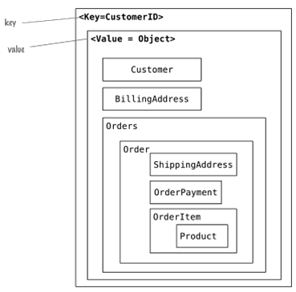
  Neste cenário, a aplicação pode ler a informação do cliente e todos os
  dados relacionados usando a chave (_key_)
- Se precisarmos recuperar "os produtos vendidos em cada pedido" devemos
  ler e percorrer todo o objeto
  - Afinal, o _value_ é apenas um "blob" que o banco armazena e envia pro
    cliente, que deve fazer _parse_ dele

---
## Modelando: **_document_**

- 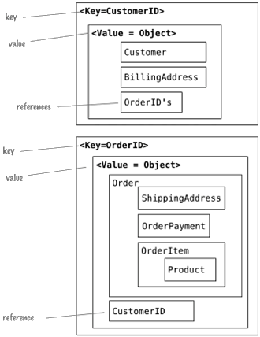
  Quando referências são necessárias, podemos usar documentos e consultar
  por campos específicos
- Com referências podemos encontrar pedidos independentemente dos clientes
- Em bancos de documentos, como eles permitem consulta por atributo (campo),
  é fácil (e barato) consultar e.g. "todos os pedidos que incluem o produtos X"

---
## Modelando: **_column-family_**

- Há várias formas - a regra geral é **tornar a consulta fácil e barata**,
  **desnormalizando** os dados **durante a escrita**
- Ao usar um banco _column-family_, **modele de acordo com o requisito da
  consulta e não do ponto de vista de armazenamento**
- Devemos usar do fato de que colunas são ordenadas e famílias de colunas
  são recuperadas juntas pelo banco de dados

---
## Modelando **_column-family_**

- 
  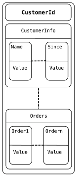
  Podemos colocar cliente e pedido em famílias de _"column-family"_
- A referência para todos os pedidos feitos por cliente está no cliente (mas
  o pedido também refere ao cliente)
- Outras **desnormalizações** são normalmente feitas para **melhorar o
  desempenho de leitura**

---
## Modelando: **_graph databases_**

- 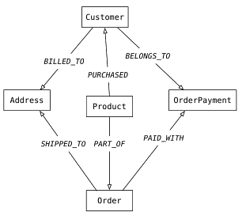
  Modelamos objetos como nós e relacionamentos como arestas
- Relacionamentos têm tipos e direção de significado
- Relacionamentos têm nomes, que possibilitam navegar pelo grafo
- Bancos de grafos permitem consultar, _e.g._:
  - Liste todos os clientes que compraram o livro "A Torre Negra"

---
<!--
  backdrop: chapter
-->

# Modelos de Distribuição

---
# Modelos de Distribuição

- Já discutimos as vantagens de se escalar verticalmente _vs._ horizontalmente
  - Horizontalmente é mais atrativo porque podemos ter os bancos de dados em
    _clusters_
  - Dependendo do modelo de distribuição, o banco pode proporcionar habilidade
    de:
    1. Lidar com grandes volumes de dados
    1. Processar tráfego de leitura/escrita maior
    1. Ter melhor disponibilidade em caso de problemas na rede

---
## Modelos de Distribuição

- Os benefícios são importantes e muito bons, mas eles têm seu preço
  - Executar sistemas em _clusters_ introduz complexidade ao problema
- Há duas abordagens para distribuição de trabalho:
  1. Replicação
    - Uma cópia dos dados em cada nó
  1. _Sharding_ (Estilhaçamento dos dados)
    - Dados diferentes em cada nó
- Vejamos algumas configurações possíveis dos modelos

---
## Modelo: **Servidor Único**

- A primeira e mais simples forma de distribuição
- Consiste em ter o banco de dados em apenas um computador
- Faz sentido usar um banco NoSQL em um único servidor:
  - Já que o modelo agregado está mais próximo do modelo de dados
    da aplicação
- Bancos de dados NoSQL de grafos não são apropriados para _clusters_
- Se o uso dos dados é bem voltado à manipulação de agregados, um _key-value_
  ou um _document store_ pode ter melhor desempenho do que um relacional

---
## Modelo: **_Sharding_**

- Frequentemente, um banco fica ocupado porque **pessoas diferentes estão acessando
  partes diferentes dos dados**
- Nesse caso, pode-se escalar horizontalmente ao colocar partes diferentes dos
  dados em servidores diferentes (_sharding_)
- O conceito de _sharding_ não é novidade do NoSQL - já existia antes
  - Contudo, era controlado na aplicação e não no banco
- Consistia em (_e.g._) colocar todos os clientes A-D em um _shard_, E-G em
  outro...
---
## Modelo: **_Sharding_** (2)

- _Sharding_ torna o modelo de programação mais complexo já que o código da
  aplicação precisa distribuir a carga entre os _shards_
- Idealmente, cada usuário deveria acessar um servidor diferente e apenas um
  servidor
  - Mas o caso ideal é ideal :)

---
## _Sharding_: Abordagens

- Para tentar aproximar do caso ideal, precisamos garantir que dados acessados
  em conjunto ("JOIN") fiquem armazenados no mesmo nó
  - Isso é muito simples usando agregados
    - **Agregados formam uma unidade natural para ser distribuída**
- Ao considerar a distribuição dos dados entre os nós temos mais alternativas:
  - _E.g._, se um cliente de Manaus acessa o sistema, seus dados (agregados)
    estarão todos em um nó (_shard_) que está na região Norte

---
## _Sharding_: Abordagens

- Deve-se considerar também que o acesso aos nós deve ser o mais balanceado
  possível
- Os agregados devem ser distribuídos uniformemente para que cada nó receba
  a mesma quantidade de carga
- Outra abordagem é colocar agregados juntos se supomos que eles serão lidos
  em sequência (_column-family_)
  - _E.g._, o BigTable armazena informações sobre páginas _web_ ordenando de
    acordo com o reverso dos domínios das páginas
    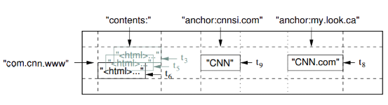

---
## _Sharding_ e NoSQL

- Em geral, muitos bancos NoSQL oferecem _auto-sharding_
- Isso torna muito mais fácil usar essa técnica de distribuição em uma aplicação
- _Sharding_ melhora muito o desempenho porque **melhora os tempos de leitura e
  escrita**
  - Já que cada nó é responsável tanto pela escrita quando pela leitura de seus
    agregados

---
## _Sharding_ e Resiliência

- **_Sharding_ faz pouco pela resiliência dos dados** quando usado sozinho
  - Já que dados diferentes estão em cada nó, **a perda de um servidor faz com
    que seus dados fiquem indisponíveis**
- Assim, na prática, fazer **apenas _sharding_ pode reduzir a resiliência**

---
## _Sharding_: o momento certo

- Alguns bancos são destinados a sofrerem _sharding_ desde o início
- Outros permitem usuários começaram com um único nó e depois distribuir
- Contudo, fazer o _sharding_ muito tardio pode causar problemas:
  - Especialmente quando feito em produção

---
# Replicação

---
## Replicação **_Master-Slave_**

- Nesta configuração, um nó é designado como _master_ (primário) e os outros
  como _slaves_ (secundários)
  - O **_master_** é a fonte autoritativa dos dados e o **único que pode escrever**
  - Os **_slaves** são usados apenas **para leitura**
- Um **processo de replicação sincroniza os dados** dos _slaves_ com os do _master_
- É **útil quando** se tem um _dataset_ em que se faz **muita leitura**

---
## Replicação _Master-Slave_ (2)

- Escala-se horizontalmente ao adicionar mais _slaves_
  - Contudo, ainda estamos **limitados à capacidade do único _master_** de
    **processar escritas**
- Um benefício é a **resiliência de leitura**:
  - Se o _master_ falha, ainda é possível ler dos _slaves_
  - Mas escritas só estarão disponíveis quando o _master_ for restaurado

---
## Replicação _Master-Slave_ (3)

- Outra característica é que um _slave_ pode se tornar um _master_
  - _Masters_ podem ser designados manualmente ou automaticamente
- Para obtermos resiliência, aplicações precisam conhecer o caminho dos bancos
  para leitura e para escrita e usá-los separadamente
  - Isto é normalmente feito usando conexões separadas aos bancos de dados

---
## Replicação _Master-Slave_ (4)

- Replicação _master-slave_ introduz a possibilidade de problemas de
  consistência
  - Aplicações lendo de _slaves_ podem receber dados ainda não atualizados

---
## Replicação **_Peer-to-Peer_**

- **Replicação _master-slave_** nos dá **escalabilidade horizontal de
  leitura**, mas não da escrita dos dados
  - Além disso, **há resiliência da leitura**, mas **não da escrita**
  - O **_master_** ainda é um **ponto único de falha**
- **_Peer-to-Peer_** resolve esses problemas ao **não ter um nó _master_**

---
## Replicação **_Peer-to-Peer_** (2)

- Todas as réplicas são idênticas (aceitam escrita e leitura)
- Com _peer-to-peer_, podemos ter falhas nos nós sem perder a capacidade de
  escrita, nem perder dados


---
## Replicação **_Peer-to-Peer_** (3)

- Adicionar novos nós para escalar horizontalmente é simples
- O custo disso é cobrado na consistência
- Ao podermos escrever em qualquer nó, aumentamos a possibilidade de gerar
  inconsistências na escrita
  - _E.g._, dois+ clientes reservando o mesmo quarto de hotel
  - Contudo, é possível mitigar esse problema

---
## Usando **_Sharding_ + Replicação**

- _Master-slave_ + _Sharding_: múltiplos _masters_, mas **cada item tem
  apenas 1 master**
  - Um nó pode ser _master_ para um dataset e _slave_ para outro
- _Peer-to-peer_ + _Sharding_: cada dataset está presente (tipicamente)
  em 3 nós replicados
  - O **fator de replicação** 3 é normalmente usado
  - Comum em bancos _column-family_

---
<!--
  backdrop: white
-->

## _Master-slave_ + _Sharding_

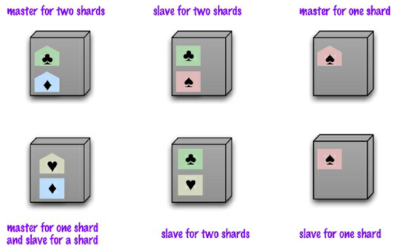

---
<!--
  backdrop: chapter
-->

# Consistência e Teorema CAP
---
## **Consistência**

One of the biggest changes from a centralized relational database to a cluster- oriented NoSQL database is in how you think about consistency. Relational databases try to exhibit strong consistency by avoiding all the various inconsistencies that we’ll shortly be discussing. Once

- Uma das maiores mudanças ao passar a usar um _cluster_ com bancos NoSQL em
  vez de um banco relacional centralizado é a consistência dos dados
- Bancos relacionais **se esforçam ao máximo** para garantir
  **consistência forte** ao evitar os tipos de inconsistências que veremos a
  seguir

---
## Mitos e Verdades

<p style="text-align: center; background: rgba(0,0,0,.15);padding:.15em .5em; border-radius: .25em; width: 70%;">
_"Bancos relacionais são ACID, logo não preciso me preocupar com consistência"_
</p>

- Veridito: mentira
  - Servidor centralizado
    - Duas+ pessoas podem reservar o último quarto do hotel, mesmo em um
      banco relacional
  - Vários servidores
    - Todas as pessoas podem efetivamente adquirir a reserva
  - Há uma diferença entre uma **transação de negócio e uma transação
    técnica**
---
## Consistência de Escrita

- Conflitos **escrita-escrita** ocorrem quando dois clientes tentam atualizar
  o mesmo dado ao mesmo tempo
  - Único servidor: serializa as escritas e as aplica em sequência
    - Uma delas será sobrescrita
- Controle de concorrência pode ser feito de forma pessimista ou otimista
  - Abordagem **<u>pessimista</u> tranca o dataset** para prevenir conflitos
  - Abordagem **<u>otimista</u> detecta conflitos e os corrige**
    - Pode usar uma **atualização condicional**: verifica se o valor corrente
      no momento da atualização é o mesmo valor recuperado durante leitura

---
## Consistência de Escrita (2)

- Outra alternativa para a abordagem otimista é **armazenar as duas
  atualizações** e marcá-los como conflitantes (estilo <abbr title="Version Control System">VCS</abbr>)
  - Uma pessoa pode resolver o conflito
  - A aplicação ou BD pode tentar resolver
    - Mas isso é muito específico de cada domínio (_e.g._, formatação de
      telefone)
- **Replicação** aumenta muito a possibilidade de conflitos escrita-escrita
  - **Usar um único nó para escrita** possibilita **evitar conflitos
    escrita-escrita** muito mais facilmente
    - Todos as configurações de distribuição, exceto _peer-to-peer_ são assim

---
<!--
  backdrop: white
-->

## Consistência de **Leitura**

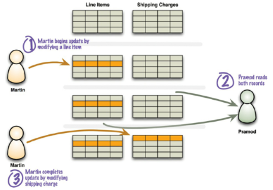

- Garantir que um banco não possui inconsistência de escritas **não garante que
  clientes** desses dados sempre **receberão respostas consistentes**
  - Solução: **transações** (mas e nos bancos NoSQL??)

---
## Consistência de Leitura (2)

- De fato, os bancos NoSQL que são orientados a agregados não possuem
  transações
  - Por outro lado, os bancos de grafos costumam ser ACID assim como os
    relacionais
- Mesmo os **bancos sem transações garantem atomicidade de operações,
  <u>intra</u>-agregado**, mas não <u>inter</u>-agregado
  - Contudo, não vamos colocar todos os dados em um mesmo agregado
  - O que nos leva de volta à possibilidade de inconsistência de leitura
    - O tempo máximo em que uma inconsistência existe é chamado **janela de
      inconsistência**

---
<!--
  backdrop: white
-->

## Consistência de Leitura (3)

- O problema de inconsistência de leitura fica **maior quando há replicação**

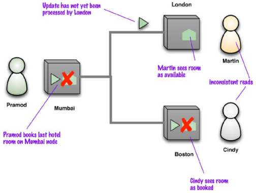

---
## Consistência de Leitura (4)

- Eventualmente, os nós terão propagado totalmente as atualizações
  - A esta característica, demos o nome de **eventualmente consistente**
- A configuração de consistência não é "global" na aplicação
  - Cada tipo de requisição pode ser configurado da melhor forma
    (_strong/weak_)

---
## Afrouxando **Consistência**

- Consistência é lindo. Podemos tentar maximizá-la em um sistema, mas
  inevitavelmente sacrificaremos outras características do sistema
  - _e.g._, uma abordagem pessimista trancando os dados
- O teorema CAP (Brewer 2000) afirma que se há uma partição na rede, você
  precisa trocar disponibilidade dos dados por consistência (ou vice-versa)
  - **Disponibilidade** (_availability_): poder ler e escrever em um nó do
    _cluster_
  - **Tolerância ao Particionamento** (_partition tolerance_): _cluster_
    sobrevive ao rompimento na comunicação dos nós

---
<!--
  backdrop: cap
-->

---
## Afrouxando **Consistência** (2)

- Em alguns casos, **não é tão problemático** ter **baixa consistência para ter
  alta disponibilidade**
  - Exemplo: **carrinho de compra** (DynamoDB da Amazon):
    - Cliente sempre pode colocar produtos ao carrinho (_availability_)
    - Problemas na rede podem gerar múltiplis carrinhos por cliente
    - No processo de fechamento, carrinho é mesclado e cliente pode revisá-lo
  - Exemplo: **hotel** permitir _overbooking_

---
## Afrouxando **Durabilidade**

- Alguns bancos podem trocar alta durabilidade por maior disponibilidade
  - Por exemplo, bancos que são _in-memory_ (Memcached, Redis etc.)
  - De tempos em tempos (_e.g._, segundos) um _backup_ é realizado em disco
- Aí vem a pergunta: qual a utilidade de um banco que pode perder seus dados?
  - Dependendo do domínio, uma possível perda (servidor desligou abruptamente)
    pode ser suportada
    - Exemplo: lista de visitantes online, sessão de usuário
- A ideia é que perder os dados de alguns eventualmente é um mal menor do
  que ter um sistema lento (indisponível) para todos

---
<!--
  backdrop: chapter
-->

# Modelos de Processamento e _Map-Reduce_

---
## Agregados e _Clusters_

- Bancos orientados a agregados mudam as regras de armazenamento (CAP)
- Mas executar em _clusters_ também muda o modelo computacional
- Quando dados estão distribuídos em nós de um _cluster_, podemos
  (devemos) processá-los de forma distribuída (paralela)

---
## Processamento no Servidor _vs_ no Cliente

- Em apenas 1 servidor, dados podem ser processados no próprio servidor ou
  em um cliente
  1. No cliente
    - Pros: flexibilidade e linguagens de programação
    - Cons: transferência de dados do servidor para cliente
  1. No servidor
    - Pros: localidade dos dados
    - Cons: linguagens e dificuldade/impossibilidade de _debugging_

---
## Computação no _Cluster_

- Podemos distribuir a computação pelo _cluster_
- Contudo, devemos tentar reduzir a quantidade de dados transferidos pela
  rede
- Devemos preservar a localidade da computação
  - Isto é, processar dados no mesmo nó onde estão armazenados

---
## Padrão: **_Scatter-Gather_**

- Podemos usar um padrão de integração chamado _scatter-gather_
- A ideia é transmitir uma mensagem para múltiplos destinatários e depois
  reunir as respostas de volta em uma única mensagem

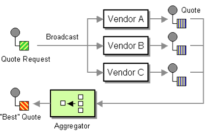

---
## **_Map-Reduce_**

- É uma forma de organizar o processamento de forma a tirar vantagem
  do _cluster_
  - Mantendo o processamento próximo dos dados sendo processados
- Ganhou fama com o _framework MapReduce_ da Google ([Dean e Ghemawat, 2004](http://research.google.com/archive/mapreduce.html))
  - 
    Então, o MapReduce foi implementado no _framework_ Hadoop
  - Contudo, frequentemente cada banco de dados implementa seu próprio
    sistema de _Map-Reduce_

---
## **_Map-Reduce_**: etimologia

- Nome inspirado nas funções `map` e `reduce` de linguagens funcionais
  - `lista map(lista aModificar)`: **transforma uma lista em outra**,
    com mais ou menos elementos, possivelmente modificados
    ```js
    var numeros = [1, 2, 3];
    var quadrados = numeros.map(function(numero) {
      return numero*numero;
    });
    ```

---
## **_Map-Reduce_**: etimologia (2)

- Nome inspirado nas funções `map` e `reduce` de linguagens funcionais
  - `valor reduce(lista aReduzir)`: **transforma uma lista em um único
    valor**, aplicando uma função a cada item para, por exemplo, achar um
    somatório, contar, achar uma média etc.
    ```js
    function soma(somaAteAgora, numero) {
        return somaAteAgora + numero;
    }
    var somatorio = quadrados.reduce(soma, 0);
    ```

---
## **_Map-Reduce_**: Exemplo

- 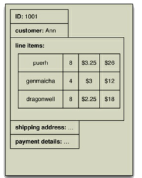
  Vamos considerar que escolhemos os **pedidos** como **agregados**
  - Cada pedido tem itens de compra que, por sua vez, tem um id de produto,
    quantidade e preço cobrado
  - Tipicamente, quando precisamos do **pedido**, também precisamos saber dos
    itens que o formam
  - Vamos considerar também que estamos usando _sharding_

---
## **_Map-Reduce_** Básico
- Contudo, e se precisarmos de um relatório mostrando **"vendas por
  produto nos últimos 7 dias"**?
  - Esta consulta seria muito cara usando a agregação que criamos
  - Uma aplicação precisaria percorrer todos os nós do _cluster_ e examinar
    muitos registros em cada um
- Este é o cenário exato em que devemos recorrer ao _Map-Reduce_

---
## **_Map-Reduce_** Básico (2)

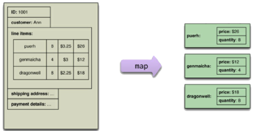

- O **`map`** é uma função que:
  - Recebe um único agregado
  - Produz um punhado de _key-value pairs_
- Neste caso, _key-value pairs_ contendo o ID do produto (chave) e um objeto
  contendo preço e quantidade (valor)

---
## **_Map-Reduce_** Básico (3)

- Cada aplicação de função `map` é independente da outra
  - Podem ser seguramente paralelizadas
  - Cada _shard_ pode fazer o `map` de seus dados
- A função `reduce` pega as saídas da `map`, **agrupadas por chave**, e
  combina seus valores

---
## **_Map-Reduce_** Básico (4)

- Uma função `map` poderia produzir (_e.g._) 1000 itens de pedidos para
  "NoSQL Distilled"
- A função `reduce` combinaria todas em apenas 1, com os totais de
  quantidade e receita
- 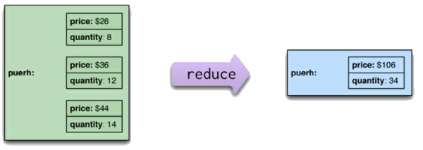
  `map` trabalha em apenas 1 agregado
- `reduce` deve usar todos os valores emitidos por uma mesma
  chave (id de produto)

---
## **_Map-Reduce_** Básico (5)

- O _framework Map-Reduce_ faz com que `map`s executem em seus respectivos
  nós e então os resultados são movidos para um nó que vá calcular o `reduce`
- Então, para escrever um _Map-Reduce_, basta implementar uma função `map`

---
## Particionando e Combinando

- É possível aumentar o paralelismo ao **particionar a saída do `map`**

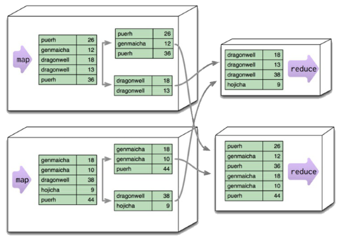

---
## Particionando e Combinando

- Tipicamente, várias chaves são agrupadas em partições
- O _framework_ então pega os dados de todos os nós para uma partição,
  os combina em um único grupo e o envia para o `reduce`r
- Múltiplos `reduce`rs podem trabalhar em paralelo e seus resultados
  são mesclados (processo _a.k.a._ _shuffling_)

---
## _Map-Reduce_ **Incremental**

- O exemplo anterior é de um _map-reduce_ completo
  - Mas executar **todas as etapas pode demorar** para grandes datasets
  - Quando novos dados são inseridos, será que precisamos executar todo
    o processo novamente?
- É possível estruturar a computação **_map-reduce_ para possibilitar
  atualizações incrementais**
  - Os estágios `map` são simples
    - Executar apenas quando os dados de _input_ mudarem
  - As partições de `reduce` são mais complexas
    - Se um `map` que tem _output_ em uma partição é atualizado,
      aquela particição deve ser recomputada

---
# Referências

- Livro _"NoSQL Distilled"_
  - Capítulo 4: _Distribution Models_
  - Capítulo 5: _Consistency_
  - Capítulo 7: _Map-Reduce_
